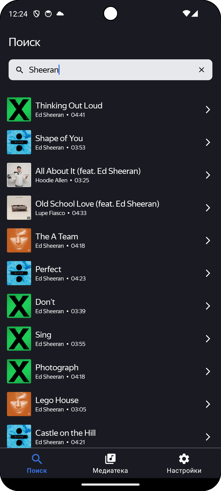
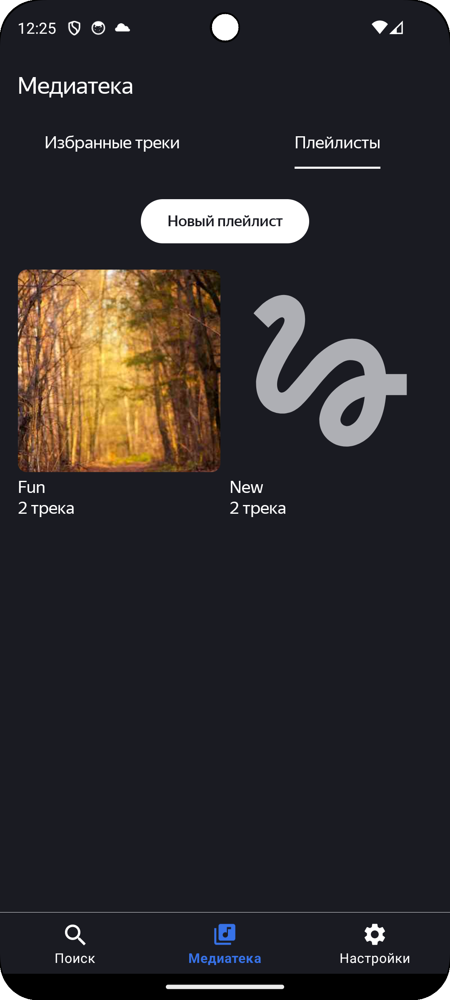
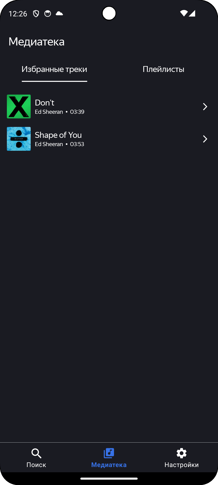
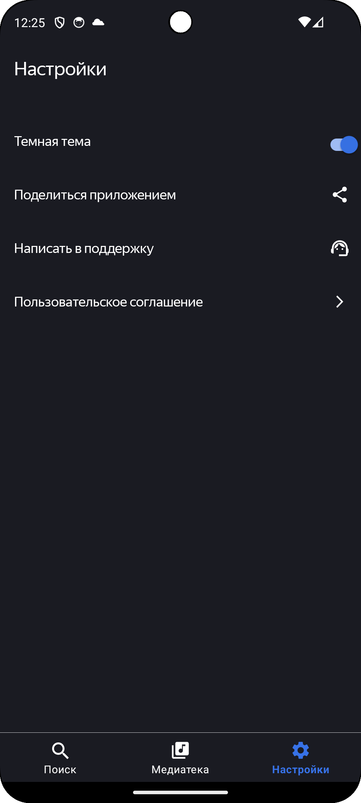

# 🎧 PlaylistMaker

**PlaylistMaker** — это Android-приложение для поиска музыкальных треков через [iTunes Search API](https://developer.apple.com/library/archive/documentation/AudioVideo/Conceptual/iTuneSearchAPI/), прослушивания 30-секундных превью, создания плейлистов, добавления любимых треков в избранное и возможности делиться своими плейлистами с друзьями.

---

## ✨ Функциональность

* 🔍 Поиск треков по iTunes API
* 🔍 История поиска
* ▶️ Воспроизведение 30-секундных превью треков с использованием `MediaPlayer`
* 💾 Сохранение плейлистов и избранных треков с помощью `Room`
* ❤️ Возможность добавлять и удалять треки из избранного
* 📂 Создание и редактирование собственных плейлистов
* 🔗 Поделиться плейлистом с друзьями
* 📂 Темная тема

---

## 🧠 Архитектура и технологии

Проект построен с использованием принципов **Clean Architecture**, включая разделение по слоям:

* **Data**: работа с сетью (`Retrofit`) и базой данных (`Room`)
* **Domain**: бизнес-логика приложения
* **Presentation**: `ViewModel`, `LiveData`, взаимодействие с UI

**Основной стек:**

* `Kotlin`
* `Retrofit`
* `Room`
* `LiveData`
* `ViewModel`
* `Koin` (внедрение зависимостей)
* `Jetpack Navigation`

---

## 🧭 Пользовательский флоу

1. **Поиск трека**
   Пользователь вводит запрос — происходит обращение к iTunes API, результаты отображаются в списке.

2. **Прослушивание**
   При нажатии на трек начинается воспроизведение 30-секундного превью с помощью `MediaPlayer`.

3. **Создание плейлиста**
   Пользователь может создать новый плейлист и добавить в него выбранные треки.

4. **Избранное**
   Любимые треки можно добавить в избранное — они сохраняются локально.

5. **Шеринг**
   Плейлист можно отправить другу, используя системное окно "Поделиться".

---

## 📸 Скриншоты


| Поиск треков                            | Плейлисты                               | Избранное                               | Настроки                                |
| --------------------------------------- | --------------------------------------- | --------------------------------------- | --------------------------------------- |
|  |  |  |  |

- Скриншоты хранятся в папке screenshots/

---

## 🚀 Установка

1. Клонируй репозиторий:

   ```bash
   git clone https://github.com/твой-репозиторий/PlaylistMaker.git
   ```

2. Открой проект в Android Studio.

3. Запусти на эмуляторе или физическом устройстве.

